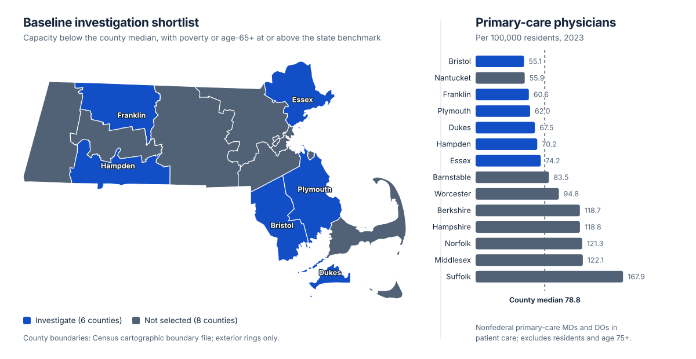

# Massachusetts Primary Care Access Planning

**Which Massachusetts counties warrant deeper investigation for primary-care access, and how stable is that shortlist under different reasonable assumptions?**

## Key finding

The baseline screen selects **Bristol, Dukes, Essex, Franklin, Hampden and Plymouth**.

**Franklin and Hampden remained on the investigation shortlist across all eight tested parameter settings, which produced five distinct shortlist outcomes.** Essex drops out under a stricter supply threshold; Barnstable enters under a broader one.

Four of the eight settings reproduce the baseline shortlist exactly, so the eight settings are not eight independent confirmations. Selection frequency across settings chosen by the analyst is not a probability.



*Left: the six baseline shortlist counties. Right: primary-care physicians per 100,000 residents against the county median of 78.8. Built from this repository's `dashboard/Data/dashboard.csv`, the same transport dataset behind the Tableau workbook. This is a figure, not a Tableau export.*

## Decision implication

These counties **warrant deeper investigation, not automatic resource allocation.** The output prioritizes where to gather evidence next. It does not establish unmet need, current appointment availability, or an optimal clinic location. Appointment availability, insurance acceptance, travel time and within-county variation would all be needed before a service decision.

The [two-page decision memo](docs/decision_memo.pdf) records the finding, the recommendation, the uncertainty and the information still missing.

## Data sources

All source data are public US federal government publications, redistributed here unmodified. They are the work of the publishing agencies, not of this project.

| Source | Publisher | Coverage | Used for |
|---|---|---|---|
| AHRF 2024–2025 county file | HRSA | 2023 counts, 2022 for a prior-year check | Non-federal primary-care physician headcounts (MDs and DOs in patient care; excludes hospital residents and physicians aged 75+; **excludes NPs and PAs**) |
| ACS 2019–2023 five-year estimates | US Census Bureau | 2019–2023 | Population and age (B01001), poverty (B17001), and margins of error. Five-year coverage includes the small island counties |
| Cartographic boundary file, 1:500,000 | US Census Bureau | 2023 | County geometry for the map |

Exact URLs, retrieval timestamps and SHA-256 download hashes are pinned in [`data/source_register.json`](data/source_register.json). [Provenance notes](docs/SOURCES.md) explain field selection and time alignment.

Small Massachusetts slices are committed so the analysis runs without network access. The full national downloads (~360 MB) are **not** committed and are reproducible on demand.

## Analytical approach

All 14 Massachusetts counties are joined on five-digit county FIPS rather than county names, and geographic checks reject missing, duplicate or incompatible keys instead of silently dropping a county.

The baseline screen selects counties where physician supply falls **below the county median** *and* either poverty or the age-65+ share sits **at or above its Massachusetts population-weighted benchmark**. The indicators are kept separate — there is no weighted composite score, no adequacy cutoff and no machine learning — so a reader can disagree with one rule without discarding the analysis.

Poverty uses *population with poverty status determined* as its denominator, not total population. Python handles acquisition, validation and margins of error; SQL joins and calculates the county measures. [Metric definitions](docs/METRICS.md) give each calculation in full.

## Validation and sensitivity

Eight parameter settings vary the capacity threshold, the workforce year, the population-context rule and the margin-of-error bounds. The recorded outcome of every setting is in [`analysis/findings.json`](analysis/findings.json), and [`analysis/county_comparison.csv`](analysis/county_comparison.csv) retains all 14 counties including those never selected.

Automated checks cover geographic reconciliation, denominator consistency, analytical outputs, sensitivity behavior and reproducible installation. Source slices are validated against pinned hashes before any calculation runs, so an upstream change surfaces for review rather than silently altering results. Suppressed or unavailable values are carried as missing, never as zero.

The margin-of-error settings are sensitivity ranges, **not significance tests**. Full detail in [validation](docs/VERIFICATION.md).

## Tableau dashboard

Download [`dashboard/MA_Primary_Care_Access.twbx`](dashboard/MA_Primary_Care_Access.twbx) and open it in Tableau Desktop or Tableau Public. The package includes its Hyper extract, so no account, upload or external map server is required. The county map and four comparison views share the baseline-shortlist colors. [Dashboard notes](dashboard/README.md) describe units and interactions.

## Reproduce locally

Requires Python 3.11 or newer. Tested on macOS arm64 with Python 3.11.5; other platforms are unverified. Run from the repository root:

```sh
python3 -m venv .venv
.venv/bin/python -m pip install -r requirements-lock.txt
.venv/bin/python -m pip install --no-deps .
.venv/bin/python -m pytest -q
.venv/bin/ma-access run
.venv/bin/ma-access memo
.venv/bin/ma-access dashboard
```

The committed Massachusetts slices mean no network or credentials are needed after installation. These commands overwrite generated files in this project only, and validate source-slice checksums before calculating.

To redownload the original national sources and regenerate the slices:

```sh
.venv/bin/ma-access fetch
```

This downloads roughly 360 MB including technical documentation. Downloads must match the pinned source register; changed publisher files require an explicit source review. The Census summary-file route needs no API key.

## Repository contents

| Directory | Contents |
|---|---|
| `data/` | Source register, Massachusetts raw slices, cleaned tables and quality results |
| `src/ma_access/` | Download and extraction, validation, sensitivity analysis, memo and workbook generation |
| `src/ma_access/sql/` | SQL analytical layer and denominator calculations |
| `analysis/` | County comparison, per-setting selections and findings |
| `tests/` | Geographic grain, missingness, transforms, metrics and artifact checks |
| `dashboard/` | Tableau workbook, extract, packaged CSV and display notes |
| `docs/` | Decision memo, data dictionary, methods, limitations and validation |

Derived percentage margins of error and setting decisions are calculated in Python and exported to CSV. Database and Hyper binary bytes are not claimed to be reproducible; tabular values are.

## Limitations

Physician headcounts are not full-time equivalents, open panels, insurance acceptance or patient travel time, and they exclude nurse practitioners and physician assistants. The observations are historical: ACS values describe a five-year period, not a current annual census.

County averages can hide neighbourhood barriers and cross-county care, and resident counts miss seasonal population. Nantucket has low physician supply but does not meet the baseline context rule — an explicit limitation of the screening design, not an indication that its access is adequate. A high-supply county such as Suffolk can still contain real barriers.

Selection frequency across the eight chosen parameter settings is not a probability, and the settings are not independent trials.

See the [data dictionary](docs/DATA_DICTIONARY.md) and [full limitations](docs/LIMITATIONS.md).
